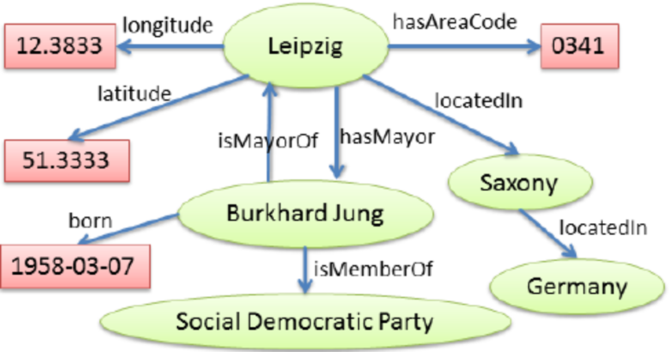
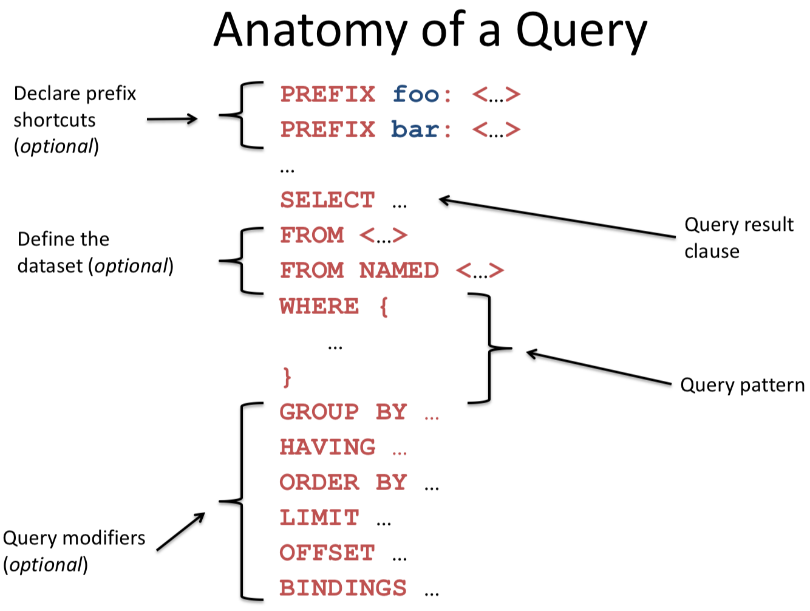

# DBpedia
DBpedia is a project aiming to extract structured content from the information in Wikipedia. DBpedia allows users to semantically query relationships and properties of Wikipedia resources, including links to other related datasets, using the SPARQL query language. DBpedia stores information in a RDF database.

# RDF
RDF ([Resource Description Framework]( https://en.wikipedia.org/wiki/Resource_Description_Framework)) databases are different than typical "spreadsheet" databases as they are in the form of a graph rather than a table. This graph consists of nodes representing objects with directed edges representing relationships between them. The term _triple_ is used to describe any two nodes with an edge connecting them.

## Example RDF Graph with 9 triples

(source https://www.researchgate.net/figure/Example-RDF-graph-containing-9-triples-describing-the-city-of-Leipzig-and-its-mayor_fig2_221510762)

# SPARQL
SPARQL (pronounced "sparkle", short for SPARQL Protocol and RDF Query Language) is a query language used to retrieve and manipulate data stored in RDF format.

## Specifics
**URIs**    
 
*Full URI written out*  
`<http://this.is.a/full/URI/written#out>`  

*URI shortened using PREFIX*  
At the top of your query put:  
`PREFIX foo: <http://this.is.a/URI/prefix#>`  
Later on you can type:  
`foo:bar`  
And it will translate to:  
`http://this.is.a/URI/prefix#bar`  

**Literals**

*Plain literals*  
`"a plain literal"`

*Plain literal with language tag*  
`"bonjour"@fr`

*Typed literal*  
`"13"^^xsd:integer`

*Shortcuts*  
`true` -> `"true"^^xsd:boolean`  
`3` -> `"3"^^xsd:integer`  
`4.2` -> `"4.2"^^xsd:decimal`  

**Variables**

`?var1`  
`?anotherVar`  
`?and_one_more`  

**Comments**
```
# Comments start with a '#'  
# continue to the end of the line
```

**Triple patterns**  
Triple patterns match two nodes (objects) and the directed edge (relationship) between them ( node1 --> node2 )  
The format of a triple is:  
`[literal/variable for node1] [literal/variable for edge] [literal/variable for node2]`  
You can put a dot at the end of the line to seperate triples.  

**Examples**  

*Match an exact RDF triple*  
`ex:myWidget ex:partNumber "XY24Z1" .`

*Match one variable*  
`?person foaf:name "Lee Feigenbaum" .`

*Match multiple variables*  
`conf:SemTech2009 ?property ?value .`

## Query format
A SPARQL query comprises, in order, of:
* **Prefix declarations** for abbreviating URIs
* **Dataset definition** stating what RDF graph(s) are being queried
* A **result clause** identifying what information to return from the query
* The **query pattern** specifying what to query for in the underlying dataset
* **Query modifiers** slicing, ordering, and otherwise rearranging results


(source http://www.iro.umontreal.ca/~lapalme/ift6281/sparql-1_1-cheat-sheet.pdf)

## Important Modifiers
### Filter
A boolean condition to reduce the query result
Functions and operators in SPARQL:
* Logical - ||, &&, !
* Comparison - <, >, = !=, IN, NOT IN
* Other - str, lang, datatype, isURI, isBlank, isLiteral, isNumeric, bound, sameTerm, langMatches, regex, REPLACE
Many other functions with SPARQL 1.1

# Example DBpedia queries
You can run these queries against DBpedia using the website [http://dbpedia.org/snorql/](http://dbpedia.org/snorql/)  

### Get an overview of Kanye West
```
PREFIX db: <http://dbpedia.org/resource/>

SELECT * where {
  db:Kanye_West ?rel ?obj .
}
``` 
Results:  
All triples starting at Kanye West.  

### Find what awards Barack Obama has won
```
SELECT ?award where {
  <http://dbpedia.org/resource/Barack_Obama> <http://dbpedia.org/ontology/award> ?award .
}
```
Results:  
Nobel_Peace_Prize  
